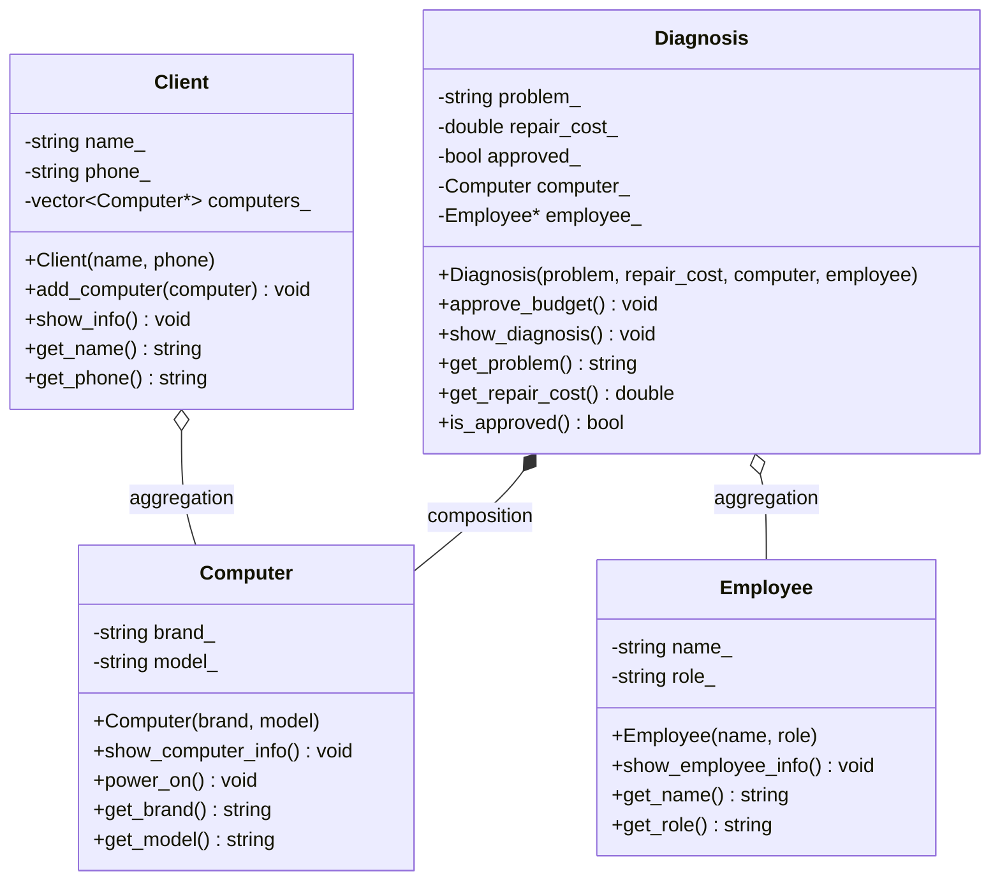

## Nome: João Rafael Gadelha de Araújo
## Matricula: 20250019213

## Descrição: Sistema de gerenciamento de manutenção com foco em tecnicos de informática, que permite cadastrar clientes, computadores, diagnósticos/orçamentos e funcionários responsáveis pelo atendimento técnico, ajudando na rotina e necessidade do empresário. 

## Diagrama UML:

## Relações entre classes

### Composição
A classe `Diagnosis` possui uma relação de composição com `Computer`, pois o diagnóstico é criado especificamente para um computador e depende dele para existir.

### Agregação
A classe `Diagnosis` possui uma relação de agregação com `Employee`, pois o funcionário responsável existe independentemente do diagnóstico.

A classe `Client` possui uma relação de agregação com `Computer`, pois o cliente apenas referencia computadores que existem independentemente dele.